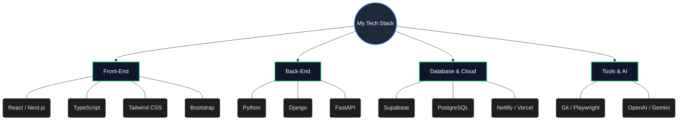
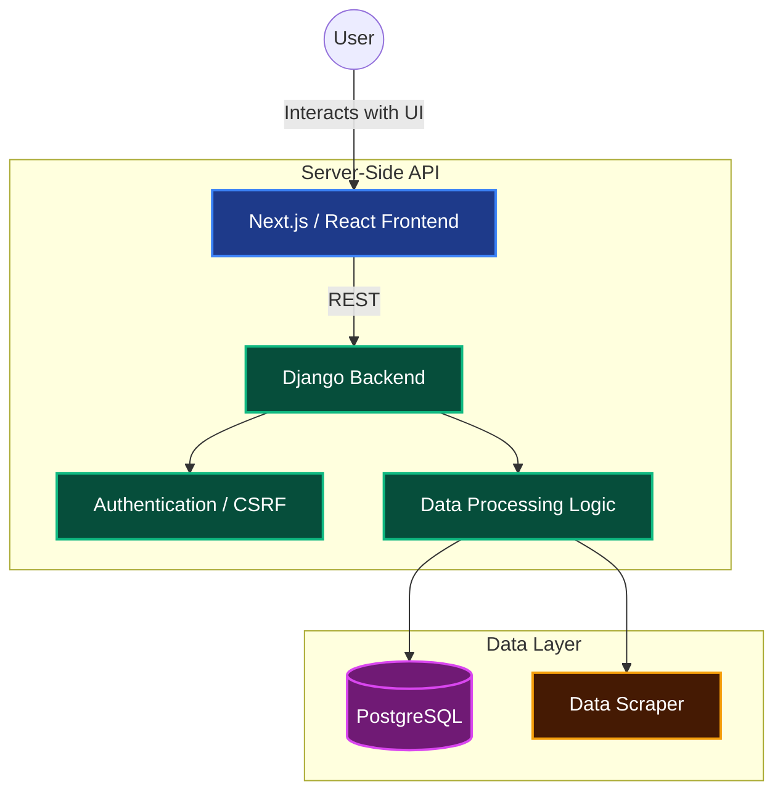

  

  
  
  

---

### 👨‍💻 About Me

I am a **Full-Stack & Front-End Specialist** with a passion for designing sleek, modern user interfaces and backing them up with robust, data-driven backend architectures. Currently studying Computer Science at APSACS and working as a Web Developer Intern at After Concept, I thrive at the intersection of beautiful UI design and advanced integrations like AI and automated data pipelines.

- 🔭 **Currently working on**: Expanding full-stack capabilities with Next.js, Django, and AI (OpenAI/Gemini).
- 🌱 **Currently learning**: Advanced Headless Browser Automation (Playwright) and Cloud Databases (Supabase).
- 💼 **Experience**: Web Developer Intern at After Concept.
- ⚡ **Fun fact**: I love turning complex data into beautiful, intuitive dashboards.

---

### 🛠️ Tech Stack & Skills

---

### 🚀 Featured Projects & Portfolio

Here is a detailed breakdown of my key projects, ranging from full-stack data dashboards to interactive frontend interfaces:

#### 1. LandDesign Intelligence Dashboard
A robust, real estate data tracking application engineered with Python and Django. 
- **Architecture**: Features secure user authentication (`csrfmiddlewaretoken`), state management, and API processing logic. 
- **Design Focus**: Transforming raw property data into an intuitive, high-performance UI.

<b>View Dashboard Architecture Diagram</b> (Click to expand)

#### 2. College Digital Hub
A comprehensive educational platform designed to streamline college operations.
- **Tech Stack**: Built utilizing Next.js for a lightning-fast frontend and FastAPI for a highly concurrent backend.
- **Features**: Database integration via Supabase, focusing on seamless student/faculty data flows.

#### 3. Bookshelf Online (`BOOK-SLEF`)
A highly interactive, modern web application for cataloging books.
- **Tech Stack**: Scaffolded with **Vite + React + TypeScript**.
- **Libraries Used**: Leverages `@tanstack/react-query` for advanced server state management, `framer-motion` for smooth UI animations, and `lucide-react` for crisp iconography.

#### 4. Lahore Gates Café / Gossip Café (`CAFE-WEBSITE`)
Responsive, highly visual landing pages created for local businesses.
- **Tech Stack**: HTML5, CSS3, JavaScript, and Tailwind CSS.
- **Features**: Utilizes Tailwind via CDN to rapidly prototype and deliver a monolithic, beautifully styled user interface without build-step overhead.

---

### 📊 GitHub Activity

  
  

  

---

### 🌐 Connect With Me

  
  
  

## Hi there 👋

<!--
**meet-muhammad-mateen/meet-muhammad-mateen** is a ✨ _special_ ✨ repository because its `README.md` (this file) appears on your GitHub profile.

Here are some ideas to get you started:

- 🔭 I’m currently working on ...
- 🌱 I’m currently learning ...
- 👯 I’m looking to collaborate on ...
- 🤔 I’m looking for help with ...
- 💬 Ask me about ...
- 📫 How to reach me: ...
- 😄 Pronouns: ...
- ⚡ Fun fact: ...
-->
