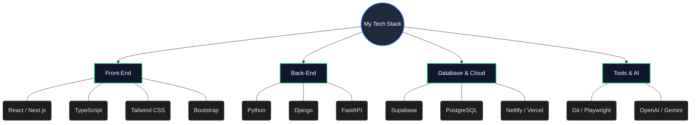
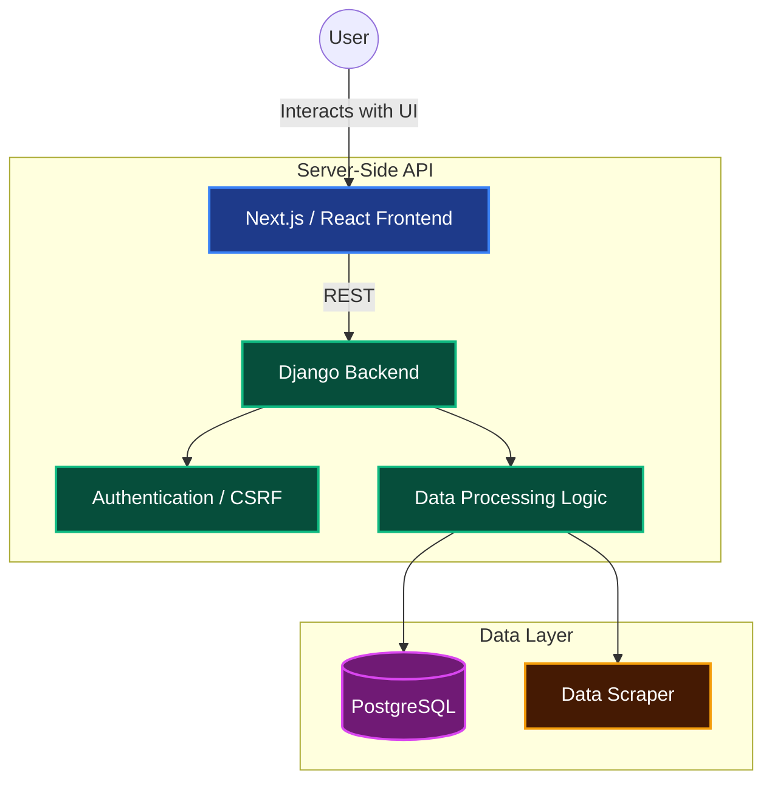

  

  
  
  

---

### 👨‍💻 Engineering Philosophy & Background

I am a **Full-Stack & Front-End Specialist** deeply focused on building scalable, performant, and meticulously designed web applications. Currently studying Computer Science at APSACS and working as a Web Developer Intern at After Concept, I approach software engineering with a strict attention to detail—from pixel-perfect UI implementations to robust, data-driven backend architectures. 

My core focus lies at the intersection of beautiful user experiences and advanced system integrations, utilizing modern frameworks alongside AI and automated data pipelines to solve complex business problems.

- 🔭 **Current Focus**: Architecting full-stack solutions using Next.js App Router, Django ORM, and integrating Large Language Models (OpenAI/Gemini).
- 🌱 **Deep Learning**: Mastering Headless Browser Automation (Playwright) for data extraction and E2E testing, alongside Cloud Database management (Supabase/PostgreSQL).
- 💼 **Professional Experience**: Web Developer Intern at After Concept, contributing to production-grade codebases and iterative UI refinements.

---

### 🛠️ Detailed Technology Stack

I believe in choosing the right tool for the job. Below is a detailed breakdown of my technical proficiencies and how I apply them in production environments:

#### 🎨 Front-End Engineering (UI/UX & Client Logic)

  
  
  
  

- **React & Next.js**: Proficient in building SSR/SSG applications, leveraging Server Components, and managing complex client state with custom hooks and `@tanstack/react-query`.
- **TypeScript**: Strictly typing props, API responses, and application state to ensure type safety and reduce runtime errors.
- **Tailwind CSS & Animations**: Designing responsive, mobile-first layouts and implementing smooth user interactions using `framer-motion` and Tailwind utility classes.

#### ⚙️ Back-End Architecture & APIs

  
  
  

- **Django**: Architecting MVC web applications, writing efficient ORM queries, and handling secure user authentication and session management.
- **FastAPI & Python**: Building high-performance, asynchronous REST APIs for microservices and data processing pipelines.

#### 🗄️ Database, Cloud & Automation

  
  
  
  

- **PostgreSQL & Supabase**: Designing relational database schemas, writing complex SQL queries, and utilizing Supabase for real-time data sync and BaaS architecture.
- **Playwright**: Automating browser interactions for robust E2E testing and scraping dynamic data from modern web applications.
- **AI Integrations**: Prompt engineering and API integration with OpenAI and Gemini to build smart, context-aware features.

<b>View High-Level Tech Stack Map</b> (Click to expand)

---

### 🚀 Featured Architectural Projects

My portfolio reflects a commitment to building complete, well-architected systems rather than just simple scripts.

#### 1. LandDesign Intelligence Dashboard
A robust, real-estate data tracking application engineered to handle complex datasets securely.
- **Security & Auth**: Implemented secure user authentication utilizing Django's built-in session management and CSRF protection (`csrfmiddlewaretoken`).
- **Data Pipeline**: Transformed raw property data into an intuitive, high-performance UI using Python processing logic.
- **Architecture**: A monolithic Django architecture connected to a PostgreSQL database, designed for rapid data retrieval and rendering.

<b>View System Architecture Diagram</b> (Click to expand)

#### 2. College Digital Hub
A comprehensive educational platform designed to streamline complex college operations and data flows.
- **High-Performance Backend**: Utilized FastAPI for asynchronous endpoint handling, dramatically reducing response times for student queries.
- **Modern Frontend**: Built with Next.js App Router for optimal SEO and fast initial page loads.
- **Cloud Database**: Integrated with Supabase for seamless, real-time database updates between faculty and students.

#### 3. Bookshelf Online (`BOOK-SLEF`)
A highly interactive, modern web application for cataloging books with a focus on UI/UX micro-interactions.
- **Build Tooling**: Scaffolded using **Vite** for incredibly fast HMR and optimized production builds.
- **Type Safety**: Fully typed with **TypeScript** to ensure reliable data structures.
- **Advanced State**: Leverages `@tanstack/react-query` for intelligent caching and server state synchronization, ensuring the UI is never blocked by network requests.

#### 4. Lahore Gates Café & Gossip Café (`CAFE-WEBSITE`)
Performance-focused, highly visual landing pages created for local hospitality businesses.
- **Zero-Build Optimization**: Utilized Tailwind CSS via CDN for rapid prototyping and deployment without complex build steps.
- **Monolithic HTML Mastery**: Structured semantic HTML5 and CSS3 to create perfectly responsive layouts that perform flawlessly on mobile devices.

---

### 📊 GitHub Activity & Statistics

  
  

  

---

### 🌐 Connect With Me

  
  
  

